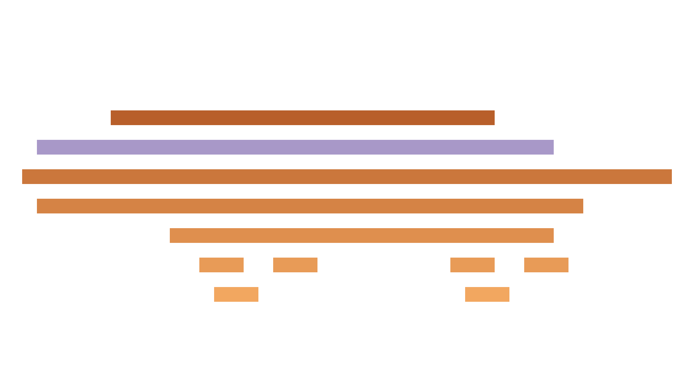
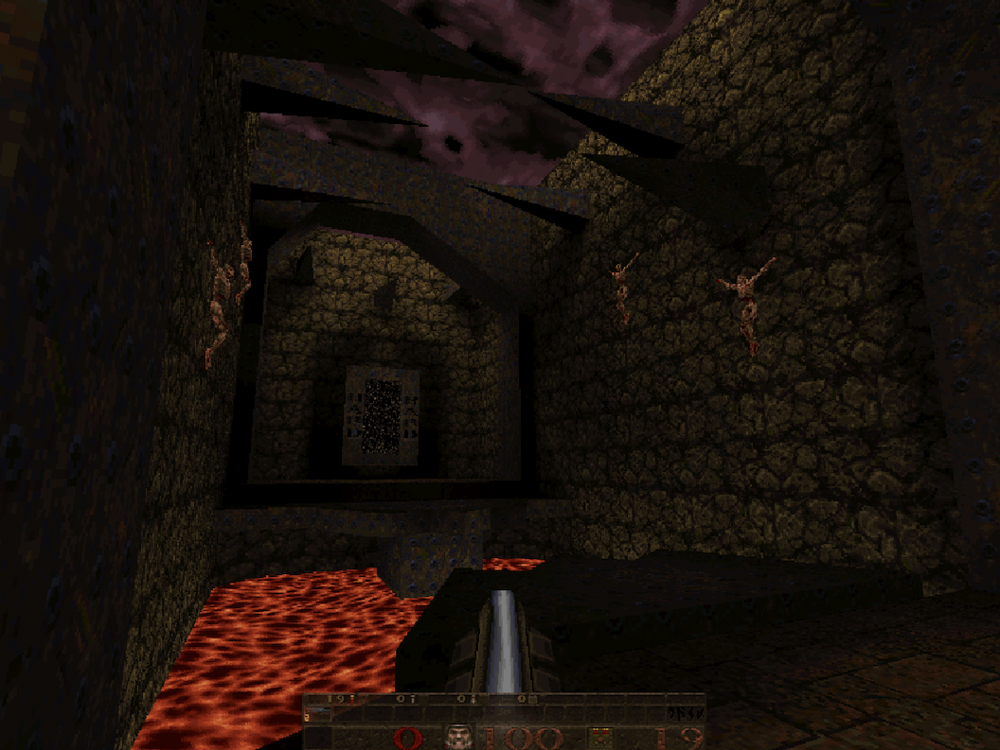
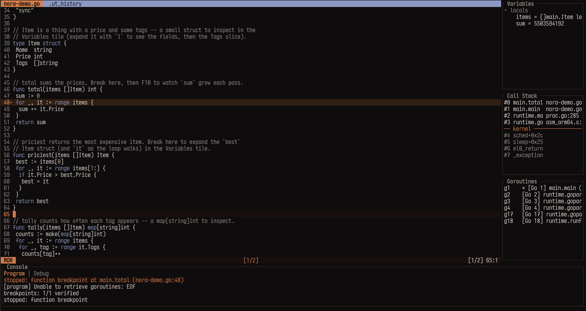
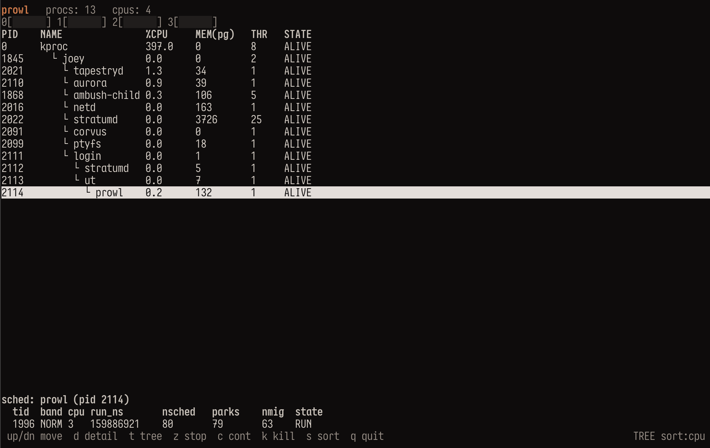

# Thylacine OS

Thylacine is a non-POSIX operating system targeting ARM64/ARMv8 that revolves around one central thesis: __[Plan 9](https://en.wikipedia.org/wiki/Plan_9_from_Bell_Labs) was right:__

- Everything is a file
- [9P](https://en.wikipedia.org/wiki/9P_(protocol)) is the universal protocol
  - Thylacine squeezes every last nanosecond of performance out of it, since it's really easy to implement 9P in a rather sub-optimal fashion (WSL2 interop FS bridge is an example)
- Per-process namespaces are the superior isolation primitive
  - Plan 9 had it in the 80s, and decades later the immensely popular Docker reimplements the same concept. Ken Thompson et al. were four decades ahead of their time.
- The kernel is a monolithic core with a deliberately minimal interface (one mechanism: 9P), and drivers are userspace programs
  - Driver faults don't take the entire kernel down with them

On top of that it adds its own convictions:

- SOTA kernel components, formally modeled in [TLA+](https://lamport.azurewebsites.net/tla/tla.html)
  - Memory management, work scheduling, transport, security model, etc., all have their formal models
- Borrow universally loved mechanisms from mainstream OSs, but stay true to our Plan 9 heritage
  - Most notably Linux, e.g. 9P2000.L, and [io_uring](https://en.wikipedia.org/wiki/Io_uring) as an inspiration for Thylacine's _Loom_
  - [Factotum](https://en.wikipedia.org/wiki/Factotum_(software)), Plan9s key manager inspired Corvus, which is promoted to the system-wide authentication and trust source (driving SAK)
- Expand on the "everything is a file"
  - Everything is a filesystem
    - Display, network, disk -- synthetic filesystems backed by 9P-speaking daemons (the console by an in-kernel device), all accessible via the kernel 9P device and grantable per-process
- We want to be usable -- transparent POSIX compatibility layer
  - Vendored and patched [musl](https://musl.libc.org) (an alternative c stdlib implementation used by, e.g., [Alpine Linux](https://www.alpinelinux.org))
  - Recompiled POSIX/Linux software just runs, its POSIX surface translated to Thylacine syscalls in userspace; static Linux binaries run best-effort
- Native Go port with a flagship TUI programming and debugging experience
  - Natively symbolized stack traces all the way to the kernel depths
  - What kind of Plan 9-heritage OS would it be without Ken Thompson's language as its primary user-facing toolchain? (Also, porting Rust's compiler on-device is nowhere near as easy -- though our native userspace is Rust.)
- A rich, media-capable, tabs-and-panes-based text terminal is the only UI
  - I don't believe in the concept of a desktop and windows in 2026. Most modern desktops now veer towards docking, which is Thylacine implements from the start in the form of a multimedia-capable graphical terminal the likes of [i3wm](https://i3wm.org) with substantial [Acme](https://en.wikipedia.org/wiki/Acme_(text_editor)) influence (Rob Pike, the author of Acme, is one of the Bell Labs' holy trinity that we revere (except for the mouse thing -- what was that?)).
- A new made-to-measure (but portable) COW filesystem -- Stratum.
  - Compiles anywhere, 9P native
  - Runs as a userspace driver in Thylacine, executes via the POSIX compatibility layer ("Pouch"), and rides the 9P kernel device -- yet reaches performance competitive with the host (tested on a big Go build directly in Thylacine)
  - Post-quantum cryptography and Merkle validation

### Why the name "Thylacine"

The Thylacine (abstractly depicted in the logo above) is an extinct (though I believe that they still roam hidden corners of Tasmania somewhere in low numbers) marsupial, also known as the Tasmanian Tiger, that my wife introduced me to -- she has a special relationship with it that she infected me with. It is a special kind of loneliness when you're the last specimen of your entire species. Calling out into the night, waiting for an answer that can never come. It stirs an unnamed, brooding emotion in us. Naming my ultimate software project after it is my little nod. The Thylacine runs free in the great NAND plains.

## Latest

### Running Quake!

A Pouch port of TyrQuake: Almost effortless, just works. Mouse look, multiplayer via UDP coming.

### Nora now supports Go (golang) debugging, LSP

Nora is Thylacine's primary Helix-like modal editor. Now LSP syntax highlighting and diagnostics kick in when a .go document is opened. `:debug [binary]` launches a debug overlay, then `:break`, `:cont`, `:step`, etc. execute debug actions using a Delve integration. HW breakpoints for now, SW breakpoints coming soon.

### Prowl -- an htop-like process manager

## Up Next

- LLVM, mesa port
- Rust toolchain
- OpenGL stack
