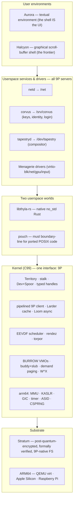
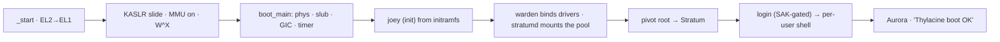
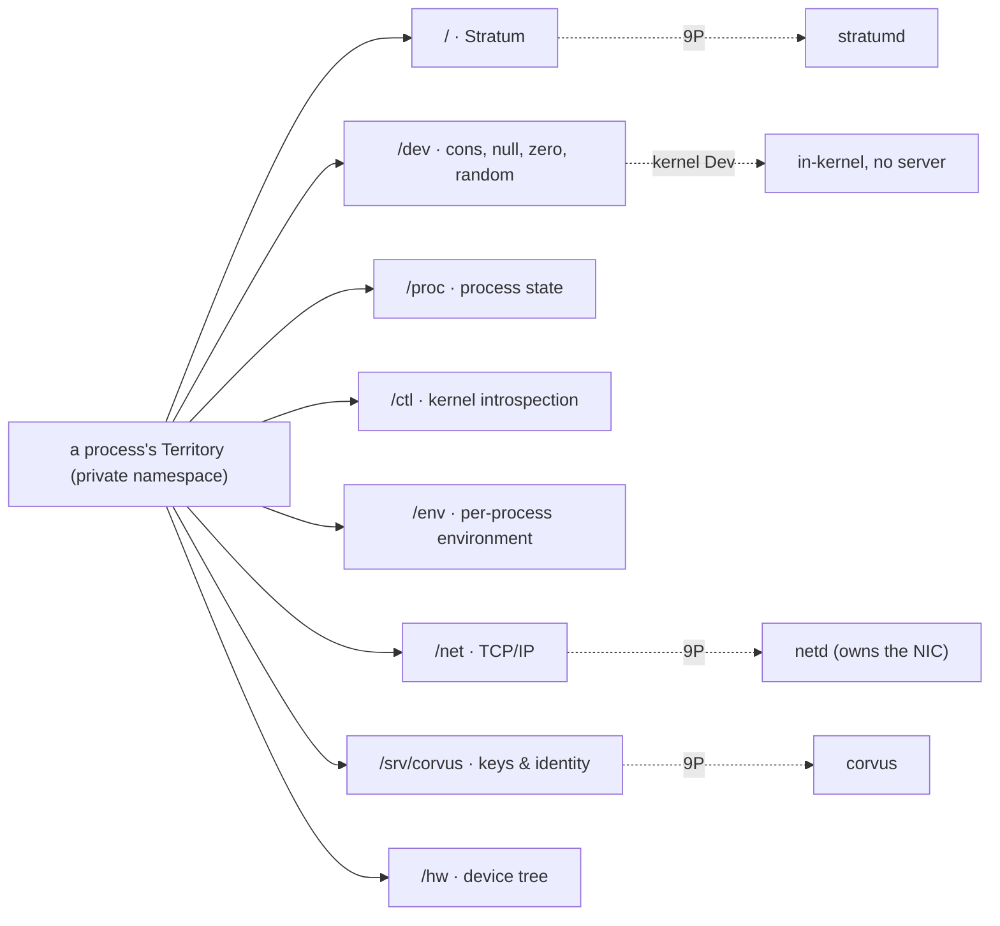
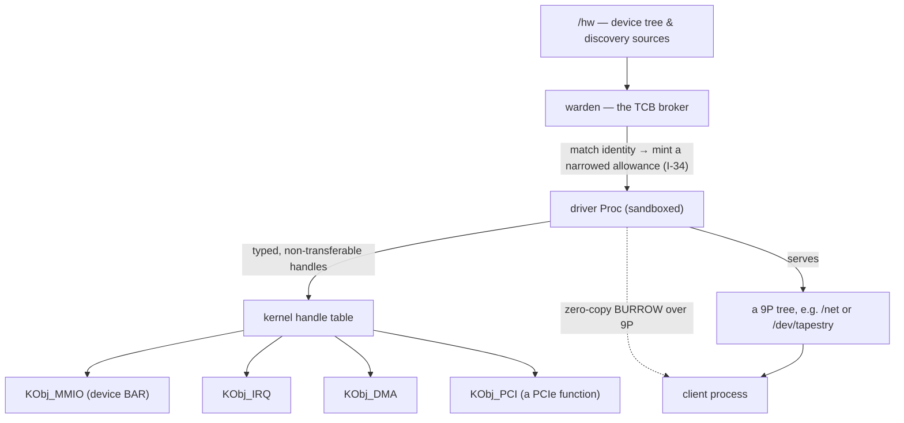
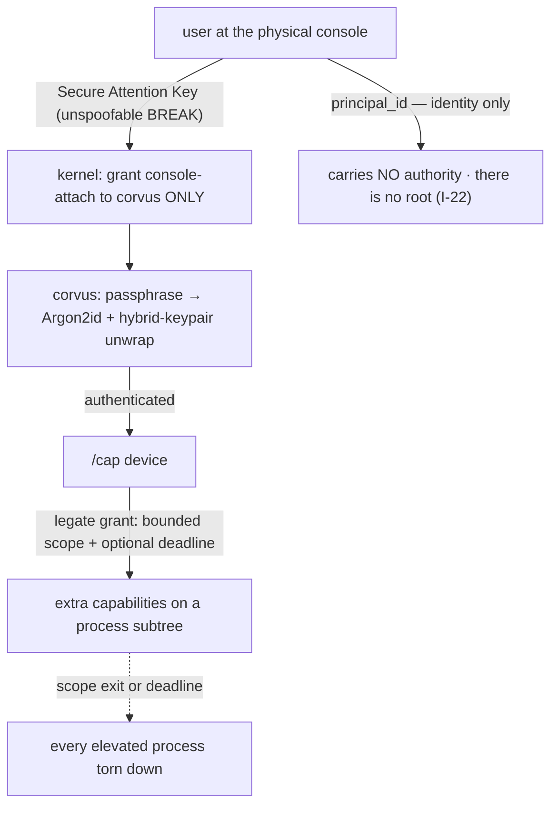
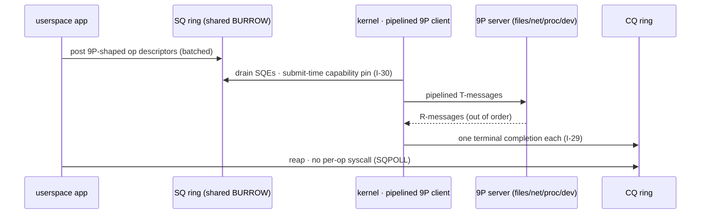
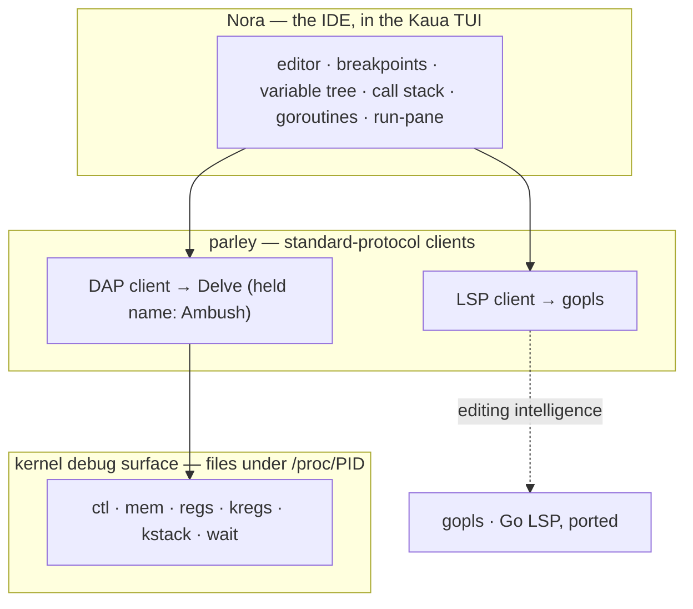
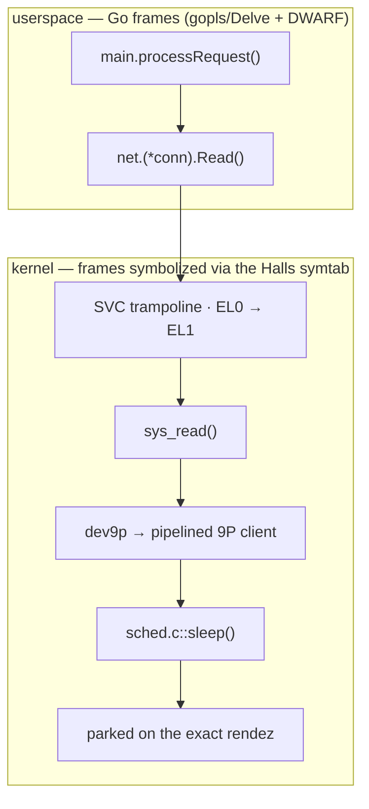

# Thylacine — A Design Overview

Thylacine is a Plan 9-heritage operating system for ARM64, built as if the industry had never walked away from Plan 9's ideas — and then finished them with 2020s hardware, cryptography, and verification. The kernel is C99; userspace is Rust. The whole system is organized around a single conviction that turns out to be load-bearing at every layer: **9P is not a filesystem protocol, it is the universal composition mechanism.** Every resource the OS exposes — devices, process state, the network, the key agent, the display, storage itself — is a synthetic filesystem served over 9P, mountable and scriptable from a shell.

This document is a bottom-up tour of the system: one tight section per architecturally-meaningful component, each explaining *how it works* and *why it was chosen*, tied back to the project's three positions — Plan 9's model was right, the shell is sufficient as a UI, and the filesystem *is* the OS — plus the methodological fourth: **complexity is permitted only where it is verified.** It is distilled from the binding scripture (`VISION.md`, `ARCHITECTURE.md`, `NOVEL.md`) and the per-subsystem reference docs under `docs/reference/`; treat those as authoritative where this summary is terse.

> **On the names.** Thylacine names things deliberately — the thylacine was a marsupial apex predator declared extinct in 1936, "lost not because it failed but because the world stopped making room for it," which is exactly Plan 9's story. So the filesystem is **Stratum** (a record preserved in layers), the textual environment **Aurora** (first light), the graphical one **Halcyon** (the impossible return); a kernel panic is an **extinction**, a Plan 9 `Chan` is a **Spoor** (the trail a predator follows), path resolution is **stalk**, the futex is **torpor** (marsupial deep-sleep). The names aren't decoration — a project that can say what it is in three words has a spine.

---

## The shape of the system

Thylacine is not a microkernel. The kernel is a real, capable, monolithic C99 kernel — it holds an EEVDF scheduler, per-process virtual memory, a pipelined 9P client, a typed-handle table, and the memory-object manager. But **drivers and services live in userspace as 9P servers**, and the *interface* to everything is uniform: 9P. The result is a system whose implementation is no smaller than correctness requires, but whose surface a reviewer (or a shell user, or an AI agent) can navigate with `ls`, `cat`, and `echo`.

A defining property, visible everywhere below: **there is no root user.** Identity (who owns a file) and authority (what you may do) are orthogonal axes. There is no uid 0; privilege is a set of *capabilities*, elevated only through a scoped, audited, cryptographically-gated mechanism — never by "being root."

**How it's built is part of the design.** Every load-bearing invariant carries a TLA+ specification, checked before the code is written; each spec ships with a *buggy* configuration that fails the invariant, as executable documentation of "this is the bug this design closes." Every change to a soundness-bearing surface goes through an adversarial audit round — a prosecutor explicitly told to break it — before merge, and the whole system is gated on multi-boot SMP stress under UndefinedBehavior/Address sanitizers. This cadence, inherited from Stratum, is why the kernel can be large without being fragile.

---

## 1. The machine: boot and the ARM64 architecture layer

**Boot and hardware discovery.** The kernel is entered directly by QEMU with a flattened device tree (DTB) in `x0` — a Linux ARM64 image header at offset 0 is a pragmatic trick that makes the loader hand over the DTB at all. `_start` optionally drops from EL2 to EL1, clears BSS, enables pointer authentication, applies a KASLR slide, turns on the MMU, and long-branches into the high half to `boot_main()`. A hand-rolled DTB parser (no libfdt) is then the *only* source of hardware truth: memory regions, devices-by-`compatible`, the KASLR seed. This is invariant **I-15** — no compile-time hardware constants exist outside the arch directory — and it is what lets one kernel image boot QEMU `virt`, Apple Silicon under Hypervisor.framework, and a Raspberry Pi, selected at boot by the DTB.

**Virtual memory, W^X, and the direct map.** The MMU brings up a split address space — TTBR0 for userspace (low half), TTBR1 for the kernel (high half, at a KASLR'd base) — with permissions enforced at the page-table-entry bit level. **W^X (I-12)** is not a runtime check but a compile-time guarantee: the PTE constructors carry `_Static_assert`s that make a writable-and-executable page unrepresentable, and the same rejection is repeated at the ELF-parse and VMA layers for defense in depth. A linear physical-to-kernel "direct map" gives constant-offset address translation and is page-mapped from boot — a deliberate port of the Linux ARM64 approach that eliminated a year-long, subtle stack-overflow bug rooted in a block→table page-table split. The whole kernel runs uniformly at EL1h with the running thread's own kernel stack as the live SP (**I-21**), which is what makes a thread safe to work-steal across CPUs mid-exception — an earlier dual-mode design silently killed a secondary CPU every boot until this was fixed.

**Interrupts, time, and going tickless.** A GIC driver autodetects v2 vs v3 from the DTB; the v2 MMIO path exists specifically to run under Hypervisor.framework on Apple Silicon, where the GICv3 path trips a hypervisor assertion. Timekeeping uses the ARMv8 virtual timer (the one timebase available on every substrate, including under a hypervisor). Rather than tick at a fixed 1 kHz forever, an idle CPU goes **tickless** (NO_HZ_IDLE), arming a one-shot to the nearest pending wake — a targeted fix after the never-stopped tick measured *332%* host CPU when idle under HVF. A per-process **rolling ASID allocator** (a direct port of Linux's arm64 design) tags TLB entries so context switches skip a full flush; the previous per-process-permanent scheme exhausted the 8-bit ASID space and killed the kernel on the 257th concurrent process — an unprivileged whole-system denial of service, closed by **I-31** and its five buggy-config counterexamples.

**When it dies, it says so.** A kernel panic is `extinction()`, which prints a greppable `EXTINCTION:` line (a stable ABI the development tooling watches) and halts. On the way down, the **Halls of Extinction** crash dumper emits a register frame, a bounded pointer-authentication-stripped backtrace, the KASLR slide, and in-kernel symbolized frames (`func+0xN`) — turning a bare faulting address into a one-boot diagnosis. The hardening baseline is SOTA-from-commit-one: stack canaries, pointer authentication, branch-target identification, LSE atomics, all runtime-conditional so one ARMv8.0-floor binary NOPs them on old cores and lights them up on capable silicon. Randomness comes from a ChaCha20 CSPRNG (the OpenBSD `arc4random` construction) seeded from a real virtio-rng source and fail-closed until seeded, so crypto-quality bytes are available identically on emulated, virtualized, and bare-metal targets.

**One kernel binary, three substrates.** Because the hardware view comes entirely from the DTB (**I-15**), the *same* kernel image runs on three targets, selected at boot: **QEMU `virt` under TCG emulation** (the deterministic CI baseline); **QEMU `virt` under Hypervisor.framework (HVF) on Apple Silicon**, where the guest executes directly on the M-series cores for a near-native development loop (TCG boots take 16–26 seconds; HVF is the fast-iteration win); and **bare-metal Raspberry Pi** — the Pi 4-class Cortex-A72 (the first board) and the Pi 5's Cortex-A76. The method (the "Lazarus" arc) is to compile to the strict **ARMv8.0-A common subset** and light up later features at runtime when the CPU actually implements them, so pointer authentication, branch-target identification, and LSE atomics are active on capable silicon (the M2, the Pi 5) and harmlessly absent on the A72 — while W^X, KASLR, vectors, and stack canaries stay unconditional everywhere. Two enablers made HVF and the Pi the *same* investment rather than two: a **GICv2** interrupt path (Apple cores expose no GICv3 CPU-interface system registers under HVF — they use Apple's own AIC — and the Pi's BCM2711 is a GIC-400/GICv2 part, so one driver serves both) and the virtual timer plus software CSPRNG above, which depend on no hypervisor-reserved or hardware-RNG feature. Real Apple-Silicon speed and real bare-metal hardware fall out of one binary, and a given board's specific peripherals drop into the userspace-driver framework (the Menagerie, §7) without touching the boot path.

---

## 2. Memory

**The allocators.** Physical frames come from a buddy allocator (orders 0–18, up to 1 GiB) with per-CPU *magazines* layered on top, so the hot path on common sizes is a lock-free per-CPU stack pop; the buddy lock is taken only on refill or large allocations. Kernel objects come from a SLUB-style slab allocator that embeds each slab's freelist in the object memory itself (zero per-object metadata) and amortizes a page across many small structs. These are the canonical modern choices — buddy from Knuth, magazines from the illumos/Bonwick lineage, SLUB from Linux — chosen because they are correct, well-understood, and fast, with a single NUMA zone at v1.0 but a zone-explicit API so multi-socket is mechanical later.

**BURROW — memory as a first-class object.** The unit of memory in Thylacine is a **BURROW**: a Virtual Memory Object, a region of pages that exists independently of any address space and is referred to by handles and mappings. Its lifetime is governed by a *dual* refcount — open handles plus active mappings — and pages are freed only when *both* reach zero (**I-7**), a discipline proven in `burrow.tla` to close both premature-free (counts positive, pages dead) and leak (counts zero, pages alive). This is Fuchsia's VMO idea, but subordinated to 9P: a BURROW is what makes zero-copy sharing possible (a framebuffer, a decoded video frame, a network ring) and it can only cross between processes over a 9P session, never by a direct transfer syscall (**I-4**). Address spaces are described by per-process sorted VMA lists over a private page table; page faults dispatch through a structured decode-and-route layer that resolves demand-zero and file-backed faults or extincts with a specific diagnostic.

**The memory the programs actually use.** Userspace anonymous memory is `SYS_BURROW_ATTACH` — an honest Plan-9-shaped split where the region's *name is its address*, with `brk` deliberately omitted (ASLR-hostile) and file-backed `mmap` deliberately refused (it can't be made network-transparent — a Plan 9 conviction kept). Because the native toolchain, musl/jemalloc, and the Go runtime all assume *overcommit*, a lazy variant reserves address space without committing pages and demand-zeros on first touch, with a `madvise(DONTNEED)`-shaped decommit — Fuchsia's model, chosen over seL4's no-overcommit because Thylacine must run arbitrary Linux binaries. Whenever the kernel dereferences a userspace pointer it does so through a **fault-recoverable uaccess** primitive (the Thylacine equivalent of Linux's exception table): a bad user pointer returns an error, never an extinction.

---

## 3. Processes, scheduling, and concurrency

**The process model is `rfork`.** Process and thread creation is Plan 9's `rfork` with flags (share memory, share namespace, share nothing), plus `exits`/`wait_pid`; `current_thread` lives in the OS-reserved `TPIDR_EL1` register so reading it is a single instruction and naturally per-CPU. The kernel schedules with **EEVDF** — the modern fair scheduler that is Linux's default since 6.6 — across three priority bands, with per-CPU run trees, inter-processor-interrupt wakeups, and work-stealing under SMP, plus a heterogeneous-multiprocessing placement foundation for big.LITTLE-style cores. The SMP core was rebuilt spec-first after a deep review: `sched_oncpu.tla` reproduces the migration race that three prior point-patches had worked around, and `sched_alpha.tla` gates the redesign that closed it by construction.

**Waiting without losing wakeups.** The wait/wake primitive is Plan 9's `sleep`/`wakeup` on a `Rendez`, where both sides take the same lock so check-and-sleep is atomic against mutate-and-wake — the classic lost-wakeup race, closed and proven as **I-9** (`NoMissedWakeup`). The userspace futex is **torpor** (`SYS_TORPOR_WAIT`/`WAKE`): the uncontended path is a user-side atomic, and only contention enters the kernel — the standard futex contract, and the substrate under pouch's pthread mutexes and condition variables. Peer threads within one process are real kernel threads sharing one page table, handle table, and namespace, spawned via `SYS_THREAD_SPAWN`.

**Loading and running a binary.** ELF images are parsed and validated with RWX segments rejected at parse time (the earliest of the three W^X layers). Execution is **REVENANT** — file-backed, demand-paged exec: a binary is roused one page at a time on fault rather than slurped whole, its read-only text mapped file-backed and *shared read-only across every process running the same binary* through a qid-keyed Image cache (Plan 9's Image model, realized as a BURROW type). This retired a 1 MiB whole-binary cap and is what lets the on-device clang/lld/git toolchain load at all; its seven soundness conditions (immutable backing, integrity-verified pages before install, death-interruptible faults, fail-closed on I/O error) are **I-36**. A per-process resource floor (**I-32**) caps pages, threads, and children so a fork/memory bomb hits a clean per-process limit instead of the allocator's box-killing cliff — a resource axis, deliberately orthogonal to the privilege axis, with the trusted computing base exempt and unforgeable.

---

## 4. The heart: the Dev/Spoor model, namespaces, and capabilities

This is where the thesis lives. Everything above and below composes on one abstraction.

**Devices and Spoors.** Every kernel-internal resource implements the verbatim Plan 9 `Dev` vtable — `attach`, `walk`, `open`, `read`, `write`, `clunk`, and the rest — and per-position state flows through **Spoor** handles (Plan 9's `Chan`, renamed for the trail a predator follows: `walk(Spoor, name)` reads naturally). A `Dev` is registered in the `bestiary` (Plan 9's `devtab`), and this single vtable is the universal shape of a resource whether it's the console, `/proc`, or a remote filesystem. That last equivalence is the crux: because a remote 9P tree is exposed through the *same* vtable, "every filesystem entity in Thylacine is a Spoor," and a local device and a networked server are indistinguishable to everything above the vtable.

**Territories are the isolation primitive.** Each process has its own **Territory** — its private view of the resource tree, composed with `bind`/`mount`/`unmount` and a root pivot. A "container" in Thylacine is not a kernel feature; it is a process with a carefully constructed Territory — a chosen root, a restricted `/dev`, a private `/proc` — with no cgroups, no container runtime, no new mechanism. The invariants are proven in `territory.tla`: operations in one process never affect another's (**I-1**), and mount points form a DAG, never a cycle (**I-3**). Path resolution is **stalk** (Plan 9's `namec`): it walks a path from a base Spoor, enforcing a per-component execute-search permission and `..`-containment that re-clamps at the namespace root so resolution can never escape the chroot boundary (**I-28**), crossing mounts on descent keyed by full Spoor identity.

**Handles are typed, unforgeable capabilities.** Alongside the namespace runs a capability layer: the **handle table**, where a `Handle` is a typed token (kind + rights + object pointer) naming a kernel object a process may touch. Ten object kinds are partitioned into three disjoint classes enforced by compile-time assertions — Transferable (process, thread, BURROW, Spoor), Hardware (MMIO, IRQ, DMA, PCI), and Srv — so an illegal transfer is not a runtime policy check but an unrepresentable operation. Rights only ever reduce on transfer or duplication (**I-6**); hardware handles are fundamentally non-transferable (**I-5**); and handles cross processes *only* over 9P (**I-4**). That `KObj_Spoor` is itself a transferable kind is what stitches the capability layer into the namespace story.

**The kernel's own 9P trees.** The kernel serves a handful of `Dev`s directly, for the resources where a userspace round-trip isn't worth it: the trivial devices (`/dev/cons` over the UART, `/dev/null`, `/dev/zero`, `/dev/random`); `/proc`, where process state is synthetic text and a write of `kill` to `/proc/<pid>/ctl` terminates a thread-group (authority gated by a two-axis owner-or-capability check, **I-26**); `/ctl`, the introspection surface (live scheduler stats, memory, the KASLR-slide-gated kernel base); `/dev` itself, an aggregating directory Dev whose `cons`/`consctl` leaves are gated at open by the trusted-path check so no process can steal the console; and `/env`, the per-process environment as a namespace object (Plan 9's `Egrp`) rather than a Unix `envp` argument — which is how the Go runtime reads its environment with no `envp` anywhere in the ABI.

---

## 5. 9P — the universal protocol

**The wire, the session, the transport.** The 9P stack is layered for auditability. A stateless byte codec marshals the 9P2000.L dialect (borrowing Stratum's defensive framing discipline — bound the server's claimed counts *before* writing any buffer). A session layer adds the per-session tag pool and fid table as an explicit state machine whose transitions map one-to-one onto `9p_client.tla`, upholding tag-uniqueness (**I-10**) and fid-stability (**I-11**). A frame-aware transport sits between them and any concrete byte pipe (a loopback for tests, a Spoor pair for a real connection), so the invariants compose through it unchanged.

**The pipelined client — the angle nobody else exploits.** 9P has always had a `tag` field for out-of-order request pipelining, and almost every 9P client in the wild ignores it, serializing one request-reply at a time and paying a throughput cliff at any real round-trip latency. Thylacine's kernel client pipelines from day one, in the Plan 9 `mountio` **elected-reader** shape: a single client can back a mount driven concurrently from every CPU, with the session lock never held across the blocking receive, tags demultiplexed as replies arrive in any order. This is Angle #3, and it is what makes a userspace filesystem and a userspace network stack fast enough to be real. On top of it sit heavy concurrency-hardening layers (back-pressure instead of session-death, request cancellation via `Tflush`, tag reclaim) that took several adversarial audit rounds to get sound.

**Making a remote tree a local device.** `dev9p` is the `Dev` that routes every vtable operation through the pipelined client to a remote server — the adapter where 9P *becomes* the universal composition mechanism, because above it a mounted filesystem is indistinguishable from a kernel-internal device. Two guest-side caches make it fast: the **Larder** caches attributes, directory entries (including negative ones), and pages already fetched, with close-to-open coherence and a cacheability gate that engages only for content-versioned servers (a streaming server like `/net` is never cached) — it eliminated 56–90% of the redundant round-trips in an on-device `go build`. And **Pounce** collapses a whole path walk into one fused `Twalkgetattr` RPC while preserving the per-component permission checks bit-for-bit — taking a single `os.Stat` from ~13 round-trips to one. (The thylacine *stalks* along the path, then *pounces* in one strike.)

---

## 6. Drivers as userspace 9P servers

Userspace drivers are non-negotiable and present from Phase 3: a device driver is an ordinary, isolated process that holds typed hardware handles and exposes the device as a 9P server. Its blast radius is its own device — it cannot crash the kernel, touch another device's memory, see another process, or escalate — and *because* of that confinement the driver ABI can be frozen and public, the exact inversion Linux's deliberately-unstable in-kernel ABI structurally cannot offer.

**The hardware handles and the transport core.** A driver mints `KObj_MMIO` (a mapped device BAR), `KObj_IRQ` (the right to receive one interrupt), and `KObj_DMA` (a DMA buffer whose physical address the *kernel* chooses, erasing the whole physical-collision bug class) — all typed, non-transferable, and gated by a `CAP_HW_CREATE` capability, with the exclusivity and non-duplication invariants proven in `handles.tla`. Interrupt forwarding reuses the scheduler's wakeup atomicity: a hardware IRQ increments a count and wakes the driver's waiter, with zero kernel involvement after setup. The kernel provides a virtio transport core and a PCIe path; `KObj_PCI` hands a driver one page-aligned PCIe function so two long-lived drivers get true per-device isolation (the reason virtio-PCI is preferred over the slot-packed virtio-MMIO transport).

**The Menagerie — a binding layer, not a boot-path edit.** Supporting new hardware should be *adding a driver*, not *editing the boot path*. The **Menagerie** reduces all hardware to a uniform `{DeviceAdded | DeviceRemoved}` event stream from pluggable discovery sources (the DTB is the one the kernel provides, at `/hw`; PCIe, USB, and overlay-EEPROM sources are userspace). The stream feeds the **warden**, a trusted broker that matches each node's most-specific identity against a bind database, mints a **narrowed hardware allowance** — the one new kernel mechanism, a per-process scoping of `CAP_HW_CREATE` to exactly a device's own MMIO windows, IRQs, DMA budget, and PCIe function (**I-34**, the hardware analog of scoped capability delegation) — and spawns a sandboxed driver with precisely that allowance and nothing more. The warden reads for information but never fabricates authority: a compromised discovery source can misidentify a device but cannot invent a memory range, because the allowance the kernel enforces is reconciled against the trusted DTB view. The model is recursive — a bound bus driver *becomes* a discovery source — so the whole Raspberry Pi RP1-behind-PCIe bring-up falls out of one rule, and the design tracks Fuchsia's DFv2 and Genode's platform-driver composition. The concrete v1.0 drivers (virtio-net, -input, -gpu) drop into this framework.

---

## 7. Storage — Stratum

Thylacine's native filesystem is **Stratum**: a post-quantum-encrypted (ML-KEM-768 + XChaCha20-Poly1305 hybrid), Merkle-integrity-verified, lock-free-metadata, content-defined-chunking, formally-verified COW filesystem — and, crucially, it was independently designed to be **9P-native**. The coupling is a free lunch: `stratumd` runs as a userspace daemon (one process per pool), the kernel mounts it at `/` by opening a 9P `Tattach` over a socket (the Linux v9fs-equivalent model), and the kernel sees only 9P operations that succeed with integrity-verified data or fail — encryption, snapshots, dedup, and tiering are entirely transparent. Stratum's own per-connection territory model maps directly onto Thylacine's per-process territory: each process gets its own connection, its own fid namespace, its own composition. Even the pattern of the OS-FS interface being *exactly the protocol the FS already speaks* is the thesis validating itself — the same 9P client that reaches a network server reaches the root filesystem.

**Making the FS writable and safe from the kernel side.** A set of thin mutation syscalls (`SYS_WALK_CREATE` — with `mkdir` folded into the create via the directory bit, the Plan 9 way — plus `fsync`, `readdir`, atomic `rename`, `unlink`) turn the read-mostly mount writable over the existing client. Positioned I/O (`pread`/`pwrite`) provides a cursor-free contract, which is what Go's parallel `io.ReaderAt` guarantee rides on. And because a 9P server is not obligated to enforce Unix rwx permissions (Stratum enforces only dataset scope), Thylacine enforces them **in the kernel at the single FS-access chokepoint** — the Linux-VFS model, the only layer uniform across heterogeneous backings — with no `principal_id` ever bypassing the check and only a console-gated host-owner capability able to override (**I-22**).

---

## 8. The POSIX bridge — pouch

Compatibility is a *useful property, not a design constraint*: when a Linux behavior conflicts with a Plan 9 one, Plan 9 wins inside the kernel and the compat layer translates in userspace. That layer is **pouch** — a first-class Thylacine libc built as a patch series against a pristine, vendored musl, split at musl's own syscall seam into a portable "upper half" (printf, malloc logic, math) and a Thylacine-native "lower half" (the OS boundary). The invariant that keeps this honest is **P-1: no foreign syscall number ever enters the kernel** — the entire burden of POSIX translation is carried in userspace, and removing pouch leaves a working OS.

The boundary-line patches are where the translation lives, and each is a small, auditable retarget: pthreads map onto torpor and `SYS_THREAD_SPAWN` (a pouch pthread *is* a Thylacine thread within one process); POSIX signals map onto the kernel's **notes** substrate — Plan 9's text-message model, which is *stronger* than POSIX (exactly-once delivery, causal ordering, non-catchable kill) and, in a novel inversion, is fd-readable-and-pollable by default so a modern daemon reads signals from its event loop instead of writing async-signal-safe handlers; AF_INET sockets translate to `/net` file operations; and real libraries (libsodium, and the full stratumd) cross-compile and run to prove the toolchain. Foreign binaries run in three tiers: native code compiled against pouch (Tier 1, load-bearing), static Linux ARM64 binaries via a syscall shim (Tier 2), and OCI containers as Territories (Tier 3) — the container isolation is the per-process namespace, not a new subsystem.

---

## 9. Userspace: init, the shell, and the textual environment

**Init is joey.** `joey` is first-userspace: it forks children, holds supervisor state, brings up the warden and stratumd, mounts the real root, pivots into it, and then getty-loops the login prompt — the boot harness becoming the long-running init. It orchestrates through a family of four `spawn` variants (plain, with-fds, with-caps, with-full) that combine `rfork` and exec: capabilities pass down through a bitwise-AND that *structurally* enforces monotonic reduction (even a malicious all-ones mask clamps to what the parent holds), and file descriptors pass as an explicit `KObj_Spoor` list — cleaner than Plan 9's copy-everything, and hardware handles are simply never eligible. The primitives underneath are the Plan 9 ones: a kernel `pipe` over a shared ring with the wait/wake discipline proven in `pipe.tla`, and `poll` — the one addition to the Plan 9 `Dev` vtable — whose register-then-observe discipline loses no readiness event and gives single-threaded servers (like corvus) a multi-source wait.

**The shell is the environment.** The textual environment is **Aurora**, and its shell is **`ut`** (Utopia): a native, `rc`-shaped shell built as pure host-testable layers — a tokenizer, a recursive-descent parser, and an evaluator with an `rc`-style unified-list value model (every value is a flat list, so argv expansion is trivial), plus job control, pipelines, redirection, glob expansion, and note-driven Ctrl-C. Utopia is the proof that the whole 9P substrate composes into something a developer can actually *use* — the milestone that "feels real, not broken." Around it sit the native coreutils and a cross-module regression binary. And the environment is genuinely self-hosting: a **native port of the Go toolchain** runs on-device, so a logged-in user types `go build` with zero setup — GOROOT derived from the executable, HOME/USER/PATH seeded through `/env`, modules pulled over `/net` — with the compiler, linker, and runtime all mapped onto Thylacine primitives.

A structural rule governs all of this: **native programs use libthyla-rs** (no_std Rust, direct syscalls — the shell, coreutils, corvus, the drivers) while **ported POSIX code uses pouch** (musl + boundary-line patches — stratumd, libsodium, Helix). It is Plan 9's own native/APE split, drawn cleanly so native programs stay Thylacine-shaped and the translation cost is paid once per surface rather than at every call site.

---

## 10. Identity, capability, and the trusted path — a system with no root

Thylacine takes "no setuid, no superuser" seriously and builds a coherent alternative.

**Identity confers no authority.** A process carries a durable `principal_id` (plus groups), inherited unchanged across `rfork` and used *only* to attribute ownership and drive rwx checks. There is no uid 0; `PRINCIPAL_NONE` is Plan 9's `none`; authority lives entirely on the separate capability axis (**I-22**). Setting identity at spawn is itself a gated capability — the setuid-equivalent, but explicit and auditable.

**corvus is the key-and-identity agent.** In the Plan 9 factotum lineage, **corvus** is a userspace 9P server (reached at `/srv/corvus`) that owns the `id ↔ name ↔ groups` mapping *and* the cryptography. It hardens itself at startup (locks its pages out of swap and coredumps, refuses randomness until the CSPRNG is seeded), then serves authentication over a binary protocol: a passphrase is verified by deriving a key with Argon2id and AEAD-unwrapping a per-user **ML-KEM-768 + X25519 hybrid keypair** (post-quantum *and* classical, so the envelope holds if either primitive does). It persists an `/etc/passwd`-shaped identity database plus LUKS-style per-user encrypted keypairs with crash-safe rename-swap durability, and offers a BIP-39 24-word recovery phrase as a second keyslot that re-wraps the keypair without invalidating any stored data key.

**Elevation is scoped and revocable.** A process publishes a service into the namespace via `/srv` (Plan 9's `#s`), and the kernel mints a per-connection `SrvConn` stamped with the client's *kernel-attested* identity carried over `SO_PEERCRED` — unforgeable, because the peer identity is copied by value at connect time, so a peer that exits can never turn an identity read into a use-after-free. On top of this, the **legate** is the sudo-equivalent-but-stronger: corvus (the sole holder of the granting capability) registers a bounded grant through the `/cap` device (a direct descendant of Plan 9's `cap(3)`), the target self-restricts and redeems it, and the kernel stamps extra capabilities onto a *process subtree with an optional deadline* — when the scope ends, **no elevated process outlives it** (unlike sudo, whose backgrounded jobs survive), enforced as **I-25**. A service reaches its own persistent storage through a storage-root capability handed to it at spawn (a walkable directory handle it chroots into and holds nothing else — the O_PATH / Fuchsia-directory-handle fusion, **I-23**).

**The trusted path.** The Secure Attention Key (a serial BREAK, later any renderer's kernel-scanned key combo) is the one input a hostile program cannot forge; on it, the kernel revokes console attachment and hands it to corvus alone, so the elevation prompt cannot be spoofed by an interposer (**I-27**). Login itself is never console-attached and never holds a raw data-encryption key — it forwards an opaque corvus token, and the per-user encrypted `/home` is bound from a Stratum child dataset unlocked through corvus — so corvus stays the single trusted console holder through a live session.

---

## 11. Networking — the network is a filesystem

Plan 9's last big idea, done straight: **the network is a 9P tree.** `netd` is a userspace daemon that the warden binds *narrowed* to exactly the NIC's PCIe function, IRQ, and a small DMA pool — nothing else — so the process that claims the device *is* the stack (hardware handles are non-transferable; a driver cannot leak its device). It embeds the pure-Rust smoltcp TCP/IP stack and serves `/net`, where you dial by opening `/net/tcp/clone`, reading the connection number, and writing `connect 10.0.0.1!80` — the Plan 9 idiom exactly. There are **no socket syscalls** anywhere in the kernel: a native program reaches the network through `libthyla-rs::net` (a `std::net`-shaped API that is a pure `/net` client), a ported program reaches it through a pouch boundary-line that translates BSD sockets to the same file operations, and TLS is a userspace rustls library that runs entirely over `/net`'s raw byte stream — the kernel and netd never see a handshake. A network firewall becomes a *narrowed namespace* (which `/net` you can see) plus a per-principal policy, not a packet-filter ruleset.

For throughput there is **Weft**, a capability-scoped zero-copy dataplane: granting a process its flow fid *also* establishes a per-flow shared-page BURROW ring between it and netd, so payload bytes travel through shared memory set up once at grant time, with **no per-operation mediation** by the stack. Isolation is the capability grant; speed is the absence of per-op mediation — and the design is a deliberate fusion (Snap's transport, Arrakis's control/data split, io_uring's registered buffers, RDMA's "registration *is* the access capability") that a five-lineage literature pass confirmed no system had assembled in software, per-flow, with the grant *being* the setup (**I-37**).

---

## 12. Async I/O — Loom, io_uring inverted

**Loom** is what makes userspace services fast enough to be real, and it is a clean inversion of Linux's io_uring. Where io_uring imports an ever-growing opcode zoo, Loom exposes the *already-pipelined 9P client* to userspace through a submission/completion ring in a shared BURROW: userspace posts **9P-shaped op descriptors**, the kernel drives them through its existing client, and R-messages return as completions correlated by user data. io_uring's hardest design question — *what is the operation vocabulary?* — simply dissolves, because 9P is already the uniform vocabulary. The same ring therefore serves files, `/net`, `/proc`, `/srv`, and devices with one op set; a read on a connection's data fid *is* recv, a multishot read on a listen file *is* an async accept loop — with no socket opcodes added. It carries a poll-thread (zero-syscall submission), multishot streams, and ordering links, and two invariants make it safe across the untrusted-app/trusted-server boundary that neither io_uring nor a raw shared-memory ring can claim: exactly-one-terminal-completion integrity (**I-29**) and a submit-time capability pin so the kernel never re-reads a shared-ring field after checking it (**I-30**, closing io_uring's own credential-versus-work CVE class).

---

## 13. Console, PTY, and the graphical substrate

**The console and pseudo-terminals.** `/dev/cons` is the one physical terminal, with a kernel-side termios line discipline (five independent flags, driven through a Plan-9-style `/dev/consctl` control file) — kept in the kernel precisely because the console is the trusted path. Pseudo-terminals split the way the whole system splits: the *security-sensitive* half is in the kernel (sessions, process groups, the pts registry, job-control stop, and the load-bearing rule that a terminal server can *never* name a process group — its only authority is a pts-scoped signal the kernel resolves to the foreground group), while the byte-shuffling half is **ptyfs**, an ordinary userspace 9P server serving `/dev/pts`.

**The display, folded into 9P at last.** The display is the last surface Plan 9 itself never fully folded into the model, and Thylacine folds it in through **Tapestry** — a graphics fast-path woven on Loom, where a present is just a `LOOM_OP_WRITE` of a rectangle and input and vsync are a multishot read, so it needs *zero* new async machinery because 9P is already the vocabulary. `tapestryd` is the compositor: a userspace driver that owns the GPU and keyboard and serves `/dev/tapestry`, through which every pixel reaches the screen. **Aurora**'s renderer is an ordinary client of that same protocol — it lights a real framebuffer from the exact console byte stream the shell already writes, so login and the shell are unaware they now paint a monitor. **Halcyon** — the anti-window, tiling, scroll-buffer-with-inline-graphics environment where images and video render inline in the transcript — is the marquee frontier, deliberately held to the last phase so its risk endangers nothing: the Aurora textual environment is a complete, shippable product on its own, and Halcyon is strictly *additive* over it.

---

## 14. Porting foreign software — SDL2 and Quake

Ported code (as opposed to native libthyla-rs code) goes through **pouch** (§8) — musl plus boundary-line patches, the Plan 9 native/APE split. The most demanding ports are graphical, and they exist to *prove the Tapestry API under real load before Halcyon commits to it* (the acceptance gate: "if SDL and Quake map cleanly, the graphics protocol is sound").

**SDL2 runs unmodified** through an `SDL_thylacine` video/event backend that maps SDL's model onto the Tapestry protocol: `SDL_CreateWindow` mints a compositor surface and maps its shared **weave** (a zero-copy BURROW the program draws into directly), `SDL_UpdateWindowSurface` is a single blocking `tpresent` write (tear-free by construction — the present either lands whole or not at all), and `SDL_PumpEvents` drains a ring fed by a background thread parked on the surface's event fid. Presents are frame-paced so a program can't overrun the 60 Hz compositor. A stock SDL program is recompiled against `libSDL2.a` and this backend — no source changes.

**Quake runs on it.** TyrQuake 0.71 (the single-player, software-renderer build) is cross-compiled via pouch against that SDL and renders id's textured 3D world live on the compositor scanout — `+timedemo demo1` puts up 969 frames at ~550–600 fps, tiled beside the Aurora console. Original Quake shipped its own software rasterizer, so this is a pure 2D-blit milestone with no GPU acceleration path involved: it exercises exec (a large binary via REVENANT), pouch/musl, the threaded event pump, the zero-copy weave, and the whole present path end to end. Mouse-look (a virtio-tablet/mouse driver) and sound (virtio-sound) are the remaining seams; hardware GL (Mesa via pouch) is a v1.1 concern, off the critical path.

---

## 15. The native Go toolchain — a self-hosting development environment

Thylacine runs the **real Go toolchain on-device**: the `go` driver, compiler, linker, and assembler plus the standard library live in the Stratum pool at `/goroot`, and `go build` compiles and links real programs *inside the guest*. Go is the first toolchain deliberately, because it is uniquely portable — the compiler, assembler, and linker are pure Go with no LLVM and no C dependency (with cgo off), so the whole thing ports the way nothing built on a C toolchain could.

The port is a `GOOS=thylacine` fork (of go1.25.3, ~54 `*_thylacine` files) that maps the runtime onto Thylacine primitives rather than emulating Linux: process exec through the spawn family, OS threads (Go's M's) through `SYS_THREAD_SPAWN`, the futex through **torpor**, clocks through the **vDSO** clock page (which removed on the order of 740 *million* `clock_gettime` syscalls per compile), and networking in the Plan 9 shape — a `netFD` over netd's `/net` tree, not BSD sockets. The environment is read from the per-process `/env` device at startup to populate `os.Environ`, so there is no Unix `envp` anywhere in the ABI. The practical payoff is that a logged-in user types `go build` with **zero setup** — GOROOT is derived from the executable, HOME/USER/PATH are login-seeded through `/env`, and modules download over `/net` using Go's own `net/http` and the userspace TLS library.

This is not a demo; it is load-bearing in two directions. It makes Thylacine self-hosting — the OS builds its own tools, including the language server and debugger below, which are themselves Go programs and so port the same way. And the on-device `go build` became the project's **whole-kernel stress oracle**: a parallel build hammers exec, the FS cache, the scheduler, torpor, and `/net` all at once, and chasing its every stall and fault to ground is what drove the Larder cache, Pounce, positioned I/O, and the overcommit memory model. (Honest edges: `gofmt`, `go build`, and `go mod` are proven; cgo, `-race`, raw-IP sockets, and BSD Unix sockets are not available, and I/O deadlines don't yet abort an in-flight operation.)

---

## 16. Kaua and Nora — the native editor stack

**Kaua** is the native console-TUI substrate — a no_std, immediate-mode, cell-grid library (the "text weave" of the Loom family: Loom → the Tapestry graphics weave → the Kaua text weave, named for the Kauaʻi ʻōʻō, the last of its bird family). An application redraws a whole cell buffer each frame and the backend diffs it against the screen, emitting only the changed cells — the screen-side of a VT protocol, built over Thylacine's device model rather than libc/termios/ncurses. Its pure layers (style, layout, widgets, events) are host-testable plain values, and input and output are *independently swappable* backends, so a future Loom-driven input source can replace the read half with no change to the output half. It consumes the trusted-path invariant (it never touches consctl) but adds no authority.

**Nora** is the runtime editor built on Kaua — a no_std modal editor in the Helix/vim lineage, and the first real full-screen application, so it doubles as the proof that the substrate can host one. It splits into a pure host-tested core (text buffer, editor state, view, theme) and a thin device binary (the Kaua backend plus file I/O behind a request seam, so the whole engine tests on the host). It is native libthyla-rs, not a pouch port. And it is the editor that becomes the IDE.

---

## 17. A Go IDE that debugs into the kernel

Open Nora, write Go, and — without leaving the OS — you have a full IDE, shipped by default: editing intelligence (completion, go-to-definition, find-references, hover, rename, live diagnostics, format-on-save) and a visual debugger, both rendered in the Kaua TUI with a dashboard layout (editor, a Variables / Call-Stack / Goroutines sidebar, and a bottom run-pane that is a *real interactive console* for the program under debug, over the PTY infrastructure). Three layers make it, and the middle one is deliberately boring so the whole thing is mostly assembly rather than invention:

**The intelligence and the debugger are ports of the standard tools.** `gopls` (the Go language server) is a `GOOS=thylacine` port that runs over the on-device toolchain and speaks LSP; the debugger is **Delve** (Go's standard debugger, itself a Go program — held name **Ambush**, the predator's strike) with a new `proc_thylacine` backend that drives the kernel debug surface and speaks DAP. Using the standard protocols means the Nora side is language-agnostic and no protocol is invented. The **parley** substrate is the client half — a JSON-RPC/LSP/DAP engine whose logic is pure and host-tested, wrapping a persistent-server transport (a one-shot subprocess model would deadlock a server that must stay alive across a debug session).

**The kernel debug surface is Plan 9's "debugging is files."** A debugger stops a target thread, reads and writes its registers and memory through the target's own page tables, walks its stack, and resumes it — all through flat files added to `/proc/<pid>`: `mem`, `regs`, `fpregs`, a `ctl` that takes `stop`/`start`/`step`/`hwbreak`/`hwwatch`, a `wait` that blocks until the target traps, and `kregs`/`kstack` for the kernel side. The stop parks the target at the one structurally-safe checkpoint (the EL0-return tail, zero locks held) and is deliberately ordered *after* the death check, so a racing termination always wins over a stop. Breakpoints, watchpoints, and single-step use the arm64 **hardware** debug registers, never a software `BRK` patched into text — because a software breakpoint would violate W^X (**I-12**) and, worse, corrupt the REVENANT shared Image cache (**I-36**), where one binary's text page is mapped read-only into every process running it. Hardware breakpoints touch neither.

**The headline: one unified user-to-kernel stack, symbolized.** This is the thing no ordinary debugger elsewhere can do. On Linux a debugger hits the syscall boundary and prints `[in kernel]` — a wall. On Thylacine the kernel, the scheduler, the namespace, and the *symbol tables* are all ours, so a goroutine blocked in a channel receive shows a single continuous stack: its Go frames, the SVC trampoline, into `sched.c::sleep`, down to the exact `rendez` it is parked on — every kernel frame symbolized by the *same* in-kernel symbol table (the Halls of Extinction `func+0xN` table) that names frames in a crash dump.

Select a kernel frame and you see *why* it is blocked, in kernel terms. And because debugging *is* mounting `/proc/<pid>`, the same mechanism opens onto capabilities no single-boundary debugger has: a resource inspector that expands "goroutine 7 blocked on fd 5" into "fd 5 = `/net/tcp/3/data`, a Weft flow to 10.0.2.2:443, 0 bytes buffered"; a scheduler view that correlates every goroutine and M against the CPUs and kernel run-queues (because we own EEVDF, a deadlock becomes a graph); capability-scoped attach to *any* process you have rights to — netd, stratumd, a stuck shell — not only what the IDE launched; and, via Stratum's copy-on-write snapshots, a debug checkpoint of the whole filesystem-plus-process state at a breakpoint. Some of these are built, some are the near frontier.

It is secure by construction: debug authority is bounded by the *same* namespace-and-capability gate as everything else on the system (**I-39**) — you may debug a target exactly when you can name its `/proc/<pid>` *and* pass the two-axis check (you own it, or you hold a debug capability), no debug operation writes executable text or escapes the target's own address space, and a dead or detached debugger provably resumes its quarry. There is no special "debugger privilege"; the capabilities that bound the rest of the OS bound the debugger too.

---

## The whole, and the state of it

Read bottom to top, the system is one idea applied without exception. A `Dev` vtable and a `Spoor` are the shape of every resource; a Territory composes those resources into a private namespace; typed handles are the private capability under the public namespace; 9P is the protocol that unifies local devices, remote filesystems, userspace drivers, the network, the key agent, and the display into a single surface you can drive with `cat` and `echo`. Where Plan 9 left subsystems outside the model — authentication, graphics, some devices — Thylacine pulls them in; where the model needed modern reinforcement — an EEVDF scheduler, post-quantum storage, capability-scoped drivers, zero-copy dataplanes, W^X and KASLR from the first commit — it takes the current state of the art and subordinates it to the thesis rather than bolting it on.

What exists today is already a real OS: it boots from an encrypted Stratum pool, runs a native shell and the Go toolchain on-device, has identity/capability/login with no root and per-user encrypted homes, a userspace network stack with TLS, an async I/O ring, capability-sandboxed drivers, and a graphics substrate carrying live 3D. The textual **Aurora** environment is the hardened, shippable v1.0 core; the graphical **Halcyon** environment is the frontier being built on top of it. Every load-bearing invariant referenced above (the `I-N` tags) is pinned by a formal specification and defended by an adversarial audit — the discipline that lets a large kernel stay sound.

The thylacine was real. So is this.
